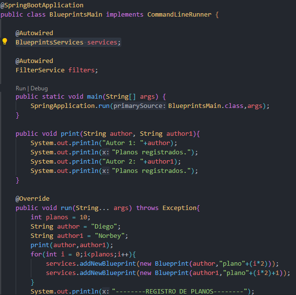

## Escuela Colombiana de Ingeniería

## Arquitecturas de Software

## Diego Leon y Norbey Cardona

# Componentes y conectores - Parte I.

El ejercicio se debe traer terminado para el siguiente laboratorio (Parte II).

#### Middleware- gestión de planos.

## Antes de hacer este ejercicio, realice [el ejercicio introductorio al manejo de Spring y la configuración basada en anotaciones](https://github.com/ARSW-ECI/Spring_LightweightCont_Annotation-DI_Example).

En este ejercicio se va a construír un modelo de clases para la capa lógica de una aplicación que permita gestionar planos arquitectónicos de una prestigiosa compañia de diseño. 

1. Configure la aplicación para que funcione bajo un esquema de inyección de dependencias, tal como se muestra en el diagrama anterior.

	Lo anterior requiere:

	* Agregar las dependencias de Spring.
	* Agregar la configuración de Spring.
	* Configurar la aplicación -mediante anotaciones- para que el esquema de persistencia sea inyectado al momento de ser creado el bean 'BlueprintServices'.

##### Según el diagrama de clases, 'InMemoryBluePrintsServices' y  'AnotherBluePrintsServices' son hijos de 'BluePrintsServices'. Mediante las anotaciones, hacemos la injección escogiendo una de estas dos; en este caso 'InMemoryBluePrintsServices' haciendo uso de la anotación @Qualifier.

###### Configuracón de anotaciones en BluePrintsServices

###### Configuracón de anotaciones en  InMemoryBluePrintsServices

2. Complete los operaciones getBluePrint() y getBlueprintsByAuthor(). Implemente todo lo requerido de las capas inferiores (por ahora, el esquema de persistencia disponible 'InMemoryBlueprintPersistence') agregando las pruebas correspondientes en 'InMemoryPersistenceTest'.

##### Implementación de requerimientos getBluePrint()

##### Implementación de algunos metodos necesarios

##### Implementación de requerimientos getBlueprintsByAuthor()
En este método se compara si el autor buscado esta en el arreglo de Blueprints y en caso de que sea así, se agrega el Blueprint al Hashset.

Se agregan varios Blueprints con el mismo autor a la memoria de Blueprints, luego se verifica que la lista de Blueprints con este autor sea igual al número creado para la prueba.

3. Haga un programa en el que cree (mediante Spring) una instancia de BlueprintServices, y rectifique la funcionalidad del mismo: registrar planos, consultar planos, registrar planos específicos, etc.

Se agregan los recursos y dependencias necesarios para el correcto funcionamiento.

Se inyecta BlueprintServices y se sobreescribe el metodo run() para insertar los planos de cada autor.

4. Se quiere que las operaciones de consulta de planos realicen un proceso de filtrado, antes de retornar los planos consultados. Dichos filtros lo que buscan es reducir el tamaño de los planos, removiendo datos redundantes o simplemente submuestrando, antes de retornarlos. Ajuste la aplicación (agregando las abstracciones e implementaciones que considere) para que a la clase BlueprintServices se le inyecte uno de dos posibles 'filtros' (o eventuales futuros filtros). No se contempla el uso de más de uno a la vez:
	* (A) Filtrado de redundancias: suprime del plano los puntos consecutivos que sean repetidos.
	* (B) Filtrado de submuestreo: suprime 1 de cada 2 puntos del plano, de manera intercalada.

En esta clase, encargada del filtrado; se tiene la variable filter que es inyectada con el tipo de filtro

La variable filter, esta asociada a la clase filterType que tiene 3 metodos de filtrado

Filtrado de redundancias: El siguiente es el método más importante de la clase FilterRedundancy donde se eliminan los Blueprint repetidos

Filtrado de submuestreo: El siguiente es el método más importante de la clase FilterSub que elimina 1 de cada dos puntos del plano

5. Agrege las pruebas correspondientes a cada uno de estos filtros, y pruebe su funcionamiento en el programa de prueba, comprobando que sólo cambiando la posición de las anotaciones -sin cambiar nada más-, el programa retorne los planos filtrados de la manera (A) o de la manera (B). 

